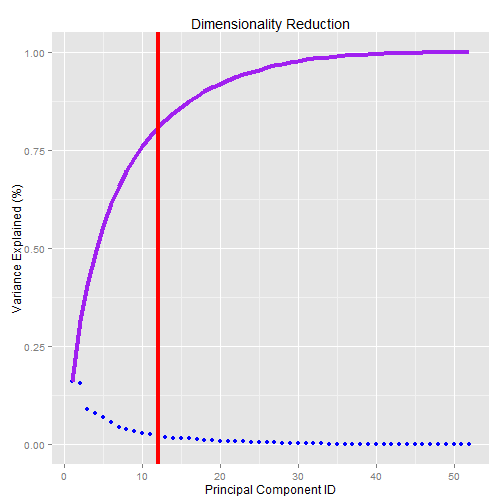

Dumbbell lifts: ¿Are you performing them correctly?
========================================================

People regularly quantify how much of a particular activity they do, but they rarely quantify how well they do it. The goal of this project is to use data from accelerometers on the belt, forearm, arm, and dumbell of 6 test subjects (males, aged between 20-28 years with little weight lifting experience) in order to determine whether the Unilateral Dumbbell Biceps Curl exercise is performed correctly. The participants were asked to perform one set of 10 repetitions of the aforementioned exercise with a relatively light dumbbell (1.25kg) in five different fashions:

* **Class A:** exactly according to the specification.
* **Class B:** throwing the elbows to the front.
* **Class C:** lifting the dumbbell only halfway.
* **Class D:** lowering the dumbbell only halfway.
* **Class E:** throwing the hips to the front.

**NOTE:** Class A corresponds to the specified execution of the exercise, while the other 4 classes correspond to common mistakes. Participants were supervised by an experienced weight lifter to make sure the execution complied to the manner they were supposed to simulate.

We will evaluate several statistical learning algorithms designed for classification problems and select the one that reports the lowest test error, which will be estimated via 10-fold cross-validation.


```
## Warning: package 'caret' was built under R version 3.0.3
```

```
## Loading required package: lattice
```

```
## Warning: package 'lattice' was built under R version 3.0.3
```

```
## Loading required package: ggplot2
```

```
## Warning: package 'ggplot2' was built under R version 3.0.3
```


## Data Processing

We will begin by loading the training & test sets from [here](http://groupware.les.inf.puc-rio.br/har):


```r
setwd("C:/Users/orojuan/Documents/Data Science/Machine learning")
if (!file.exists("./plm_train.csv")) {
    download.file("https://d396qusza40orc.cloudfront.net/predmachlearn/pml-training.csv", 
        "./plm_train.csv")
}
if (!file.exists("./plm_test.csv")) {
    download.file("https://d396qusza40orc.cloudfront.net/predmachlearn/pml-testing.csv", 
        "./plm_test.csv")
}
train <- read.csv("./plm_train.csv", header = T, sep = ",", comment.char = "")[, 
    -1]
test <- read.csv("./plm_test.csv", header = T, sep = ",", comment.char = "")[, 
    -1]
date <- strptime(train[, 4], "%d/%m/%Y %H:%M")  #Format as datetime
```


Since there is a large amount of features in the training set with a high rate of either NA's or Blanks (19216 out of 19622 records), we will exclude them from the analysis. We will also prescind from the first 6 features since they are related to the time at which the exercise was performed (there are only 4 diffentent hours and 4 different days), as well as the participant involved (we want the algorithm's prediction power to extrapolate to other people):


```r
train <- train[, -c(1:6, 11:35, 49:58, 68:82, 86:100, 102:111, 124:138, 140:149)]
test <- test[, -c(1:6, 11:35, 49:58, 68:82, 86:100, 102:111, 124:138, 140:149)]
```


## Dimensionality Reduction

Even after cleaning the dataset we still have 53 columns so, in order to avoid the curse of dimensionality, we will apply principal components analysis to find new uncorrelated features explaining most of the variance:


```r
pc <- svd(scale(as.matrix(train[, -ncol(train)])))  #Principal Components
sigma <- pc$d^2/sum(pc$d^2)  #Variance Explained
ggplot(data.frame(x = 1:(ncol(train) - 1), y = sigma, cum = cumsum(sigma)), 
    aes(x, y)) + geom_point(col = "Blue") + geom_line(aes(x, cum), col = "Purple", 
    size = 1.5) + geom_vline(xintercept = which(cumsum(sigma) > 0.8)[1], col = "Red", 
    size = 1.5) + ggtitle("Dimensionality Reduction") + xlab("Principal Component ID") + 
    ylab("Variance Explained (%)") + ylim(c(0, 1))
```



```r
rm(list = c("pc"))
```


By only accounting for the first 12 principal components, we were able to explain 80% of the total variance. We will now proceed to set the folds for the cross-validation and to project the original feature space onto the new subspace:


```r
ctrl <- trainControl(method = "cv", number = 10)
prep <- preProcess(train[, -ncol(train)], method = "pca", thresh = 0.8)
dat <- cbind(predict(prep, train[, -ncol(train)]), classe = train[, ncol(train)])
```


## Training

For this phase, we will train different algorithms and store their cross-validated accuracy:

* K-Nearest Neighbours
* Linear Discriminant Analysis
* Quadratic Discriminant Analysis
* Support Vector Machine (using a Radial kernel)


```r
fit1 <- train(classe ~ ., data = dat, method = "svmRadial", trControl = ctrl)
```

```
## Loading required package: kernlab
```

```
## Warning: package 'e1071' was built under R version 3.0.3
```

```r
svmAcc <- sum(fit1$resample$Accuracy)/10
fit2 <- train(classe ~ ., data = dat, method = "knn", trControl = ctrl)
knnAcc <- sum(fit2$resample$Accuracy)/10
fit3 <- train(classe ~ ., data = dat, method = "lda", trControl = ctrl)
```

```
## Loading required package: MASS
```

```r
ldaAcc <- sum(fit3$resample$Accuracy)/10
fit4 <- train(classe ~ ., data = dat, method = "qda", trControl = ctrl)
qdaAcc <- sum(fit4$resample$Accuracy)/10
```


CV-Accuracy:
* **KNN: ** 0.9544
* **LDA: ** 0.4659
* **QDA: ** 0.5641
* **SVM: ** 0.8324

## Model Selection & Prediction

Clearly, KNN has the best performance and therefore will be used to classify the test cases:


```r
votes <- predict(fit2$finalModel, predict(prep, test[, -ncol(test)]))
fcst <- toupper(letters)[apply(votes, 1, which.max)]
pml_write_files(fcst)
```


According to the labels provided by the couse platform, this algorithm was able to correctly classify 19 out of 20 test cases, reporting an accuracy of 0.95 (pretty close to the estimated test error obtained by cross validation).

## Bibliography

* Velloso, E.; Bulling, A.; Gellersen, H.; Ugulino, W.; Fuks, H. Qualitative Activity Recognition of Weight Lifting Exercises. Proceedings of 4th International Conference in Cooperation with SIGCHI (Augmented Human '13) . Stuttgart, Germany: ACM SIGCHI, 2013.
